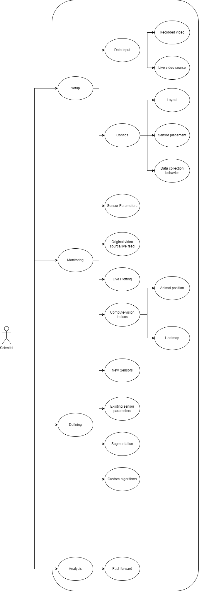

# Requirements Analisys

Framework for Activity Real-time Monitoring software

## Actors

- The cammera

- The user


## Usecases

- Users do not need to know programming to define and use sensors.

- Users can use existing sensors or define new sensors to measure.

- The layout should be automatic identified and the areas of compartmentalization.

- Automatic selection of video processing algorithms.

- The aplication should have a simplistic and intuitive layout.

- The aplication allows processing of the recorded videos and the result should be immediately computed.

- The aplication allow ploting the statistics in realtime.

- The layout is customizable by the users, when it comes to metrics or indices.

- Application can be easily set up, the minimum requirements being a laptop and a sensor


## Diagrams

### *Processing chain*

```blockdiag
blockdiag {
  video-stream -> video-controller;
  video-record -> video-controller;
  video-controller -> cv-processor;
  cv-processor -> sensors-filtering -> data-collecting;

  video-stream [color = "greenyellow"];
  video-record [color = "greenyellow"];
  data-collecting [color = "pink"];
  sensors-filtering [color = "orange"];
}
```

---

### *Sensors hierarchy*


---

### *Context diagram*

```plantuml
@startuml
!include C4_Context.puml

LAYOUT_WITH_LEGEND()

title System Context diagram for Framework for Activity Real-time Monitoring software

Person(user, "Scientific Staff", "A user of the farm software")

System(farm_software, "Framework for Activity Real-time Monitoring software", "Allows user to view, config and run analyzes on the study environment")

System_Ext(input_feed, "Data input feed", "The data sources for analysis are either records or items")


Rel(user, farm_software, "Uses")
Rel_Neighbor(farm_software, input_feed, "consume data", "OSI/COM")

@enduml
```
---

### *Container diagram*

```plantuml
@startuml
!include C4_Container.puml

LAYOUT_TOP_DOWN()
LAYOUT_WITH_LEGEND()

title Container diagram for Framework for Activity Real-time Monitoring software

Person(user, "Scientific Staff", "A user of the farm software")

System_Boundary(farm_software, "Framework for Activity Real-time Monitoring software", "Allows user to view, config and run analyzes on the study environment") {
  Container(presentation_l, "Presentation", "JS, Web, GUI", "The interface through which the user interacts with the system")
  Container(cv_l, "Compute Vision App", "Python, opencv", "Process the source information and identify clues for analysis")
  Container(sensors_l, "Sensors Processing", "Python", "Process identifies cv indexes and builds other indicator information")
  Container(datacollection_l, "Data Collecting & Analitycs", "Python, bokeh", "Agregate data and delivers the static content")
}

System_Ext(input_feed, "Data input feed", "The data sources for analysis are either records or items")


Rel(user, presentation_l, "Interact")
Rel(presentation_l, cv_l, "Config")
Rel(presentation_l, sensors_l, "Config sensors")
Rel(cv_l, sensors_l, "Send indices")
Rel(sensors_l, datacollection_l, "Send data")
Rel(datacollection_l, presentation_l, "Update status")

Rel_Neighbor(cv_l, input_feed, "consume data", "OSI/COM")

@end
```
---

### *Component diagram*


---

### *Use-case diagram*




---
