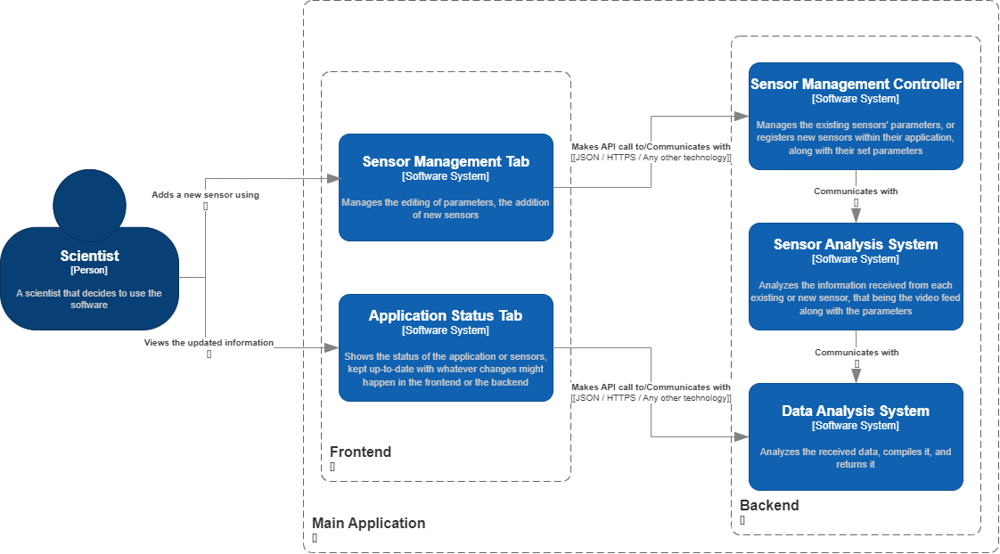
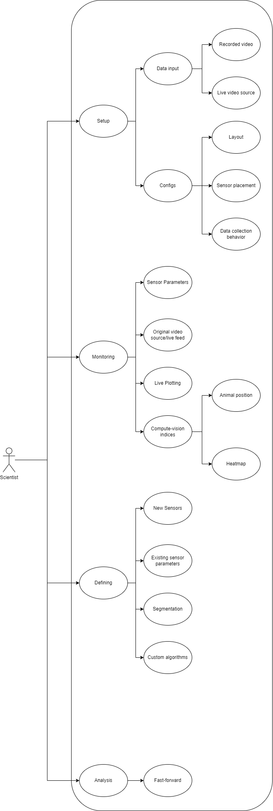
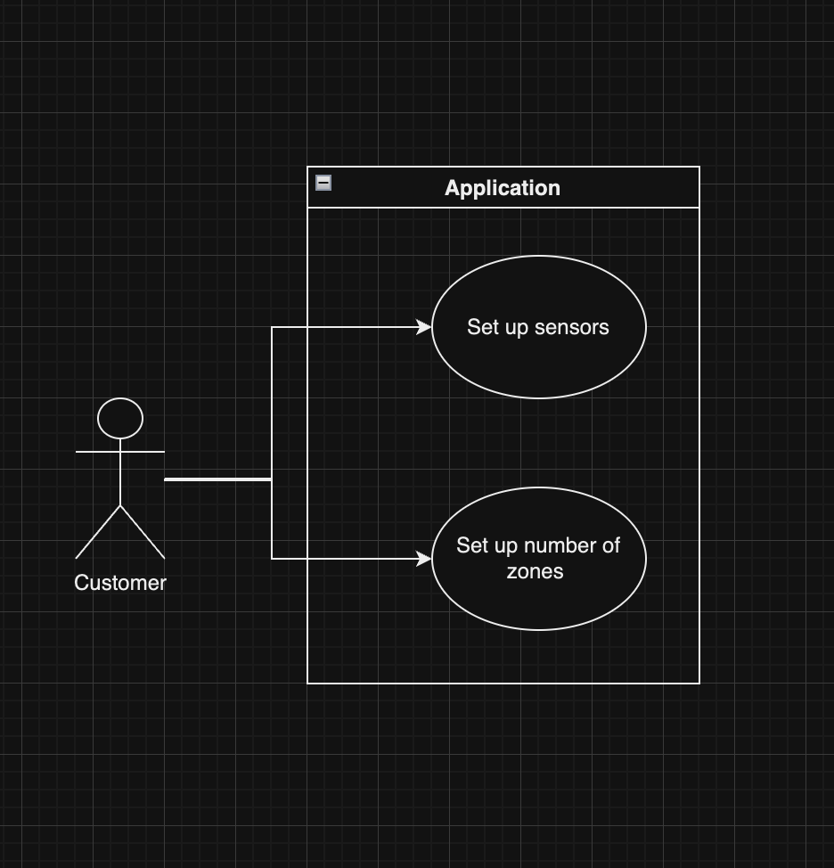
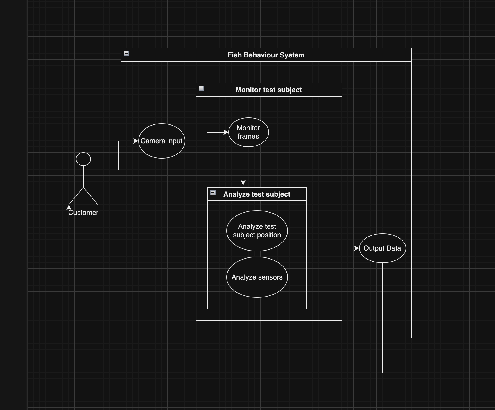
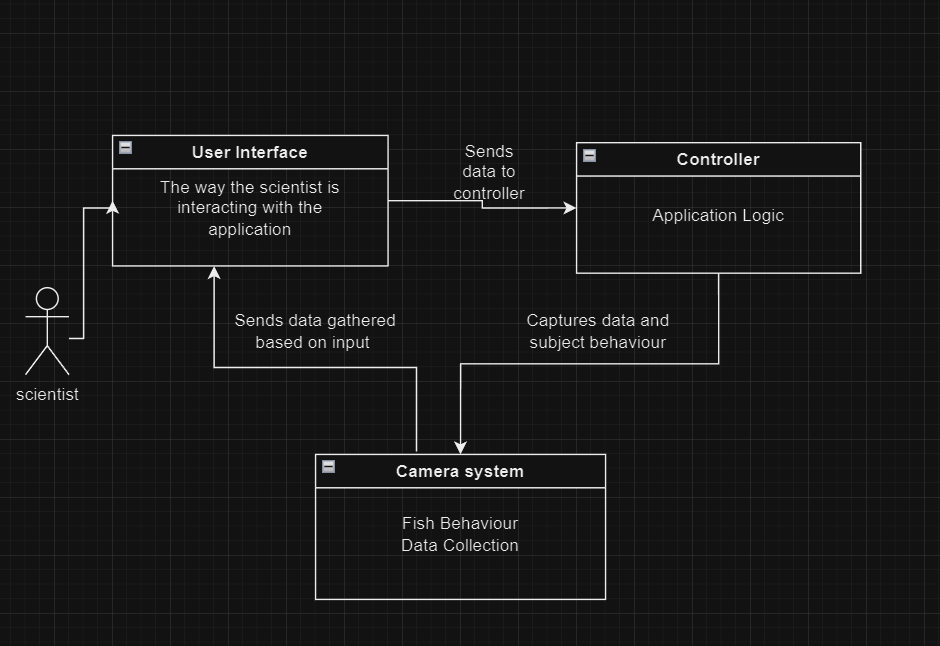

# Requirements Analisys

Framework for Activity Real-time Monitoring software

## Actors

- The cammera

- The user

## Usecases

- Users do not need to know programming to define and use sensors.

- Users can use existing sensors or define new sensors to measure.

- The layout should be automatic identified and the areas of compartmentalization.

- Automatic selection of video processing algorithms.

- The aplication should have a simplistic and intuitive layout.

- The aplication allows processing of the recorded videos and the result should be immediately computed.

- The aplication allow ploting the statistics in realtime.

- The layout is customizable by the users, when it comes to metrics or indices.

- Application can be easily set up, the minimum requirements being a laptop and a sensor

## Diagrams

### *Processing chain*

---

### *Sensors hierarchy*

---

### *Context diagram*

---

### *Container diagram*

---

### *Component diagram*

---

### *Use-case diagram*

---