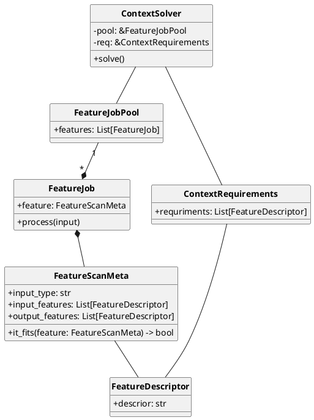

# automatically cv algorithm choses

As a scientist in experimeet. As example, to obtain the speed, traces or zone transition counters, the sensors need other indexes, in this case the **position**. We use the prnts certain indexes are followed. These are obtained by placing sensors depending on the context and the desired targinciple of **dependency inversion**. Algorithms are created that match a set of meta data in a class. From this pool of algorithms we will be able to correlate through the desired metadata. The Metadata provided must contain data such as input format, input and output indexes



```py

algo = [al1, al2, al3, al4]

f_data = ...

for a in algo:
    f_data = a.process(f_data)

...

```


# video stream platform independent

A feedback is given by the post-processed video content which, depending on the algorithms used, generates certain artifacts such as contour geometric figures, traces, hitmaps. This is to facilitate a varied range of devices that can be connected and tracked. `aiortc` is used for backend and `webRTC` for frontend.

# aspect logging

We collect all errors through several hooks. For exceptions, the relevant data is saved for each frame.

